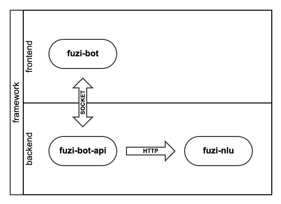

# fuzi bot api

[](https://github.com/Ailln/fuzi-bot-api/blob/master/LICENSE)
[](https://github.com/Ailln/fuzi-bot-api/stargazers)
[](https://github.com/Ailln/fuzi-bot-api/network/members)

🤖️ 聊天机器人——`夫子`的「聊天接口」模块。

## 1 简介

`夫子` 聊天机器人有 8 个模块组成：
1. [fuzi-bot](https://github.com/Ailln/fuzi-bot): 聊天界面模块，与用户进行交互。
2. [fuzi-bot-api](https://github.com/Ailln/fuzi-bot-api): 聊天接口模块，与其他后端模块通信。
3. [fuzi-nlu](https://github.com/Ailln/fuzi-nlu): 自然语言处理模块，理解用户的问题。
4. [fuzi-search](https://github.com/Ailln/fuzi-search): 语义检索模块，快速查找已有问题。
5. fuzi: 对话管理模块，推断用户的意图。
6. fuzi-admin: 后台管理模块，管理机器人的设置。
7. fuzi-admin-api: 后台管理接口，与其他后端模块通信。
8. fuzi-mark: 数据标注模块，标注用户的问题。



## 2 快速上手

```shell
git clone https://github.com/Ailln/fuzi-bot-api.git

cd fuzi-bot-api
# 安装依赖
pip install -r requirements.txt

python -m run.server
```

## 3 部署

### 3.1 Docker

```shell
git clone https://github.com/Ailln/fuzi-bot-api.git

cd fuzi-bot-api
# 打包
docker build -t fuzi-bot-api:1.0.2 .
# 运行
docker run -d --restart=always --name fuzi-bot-api -p 8080:8080 fuzi-bot-api:1.0.2
```

### 3.2 Kubernetes

```shell
cd fuzi-bot-api

docker tag fuzi-bot-api:1.0.2 192.168.2.101:5000/fuzi-bot-api:1.0.2
docker push 192.168.2.101:5000/fuzi-bot-api:1.0.2

kubectl apply -f deploy/deployment.yaml
```

### 4 QPS Test

```shell
pip install locust -U

locust -f test/qps_test.py -H http://127.0.0.1:8080 -u 10 -r 2
# 打开 http://0.0.0.0:8089
```

## 5 许可证

[](./LICENSE)
[](https://github.com/Ailln/award)

## 6 交流

请添加微信号：`Ailln_`，备注「fuzi」，我邀请你进入交流群。
